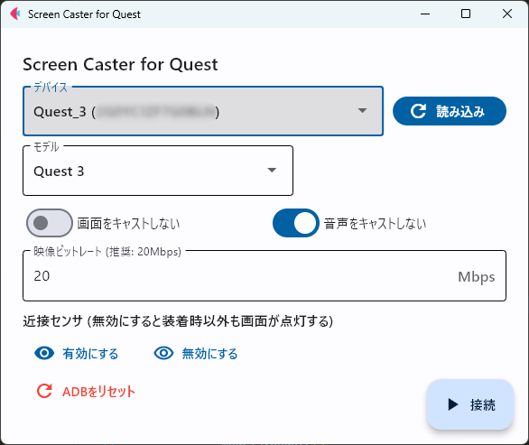

# Scrcpy GUI for Quest

A simple GUI for [Scrcpy](https://github.com/Genymobile/scrcpy), a tool for displaying and controlling Android devices connected via USB or TCP/IP. 

This GUI is specifically designed for Meta Quest devices.



## Features
- Simple GUI of scrcpy
- Mirror multiple devices simultaneously
- Adjust screen size for Quest devices
- Toggle proximity sensor


## Prerequisites

- Python 3
  - `flet` Library is required.
- Only works with Windows

## Usage
- Download latest zip file from [release page](https://github.com/hiroyamochi/quest-screen-caster/releases/latest)
- Unpack downloaded zip file
- Launch screen-caster-quest.exe

## Build
- You will need `pyinstaller` to build a binary file (.exe)
- Run following in the project directory:
```bash
pyinstaller main.py --onefile -w --icon=icon.ico --add-data "icon.ico;icon.ico" --add-data "scrcpy:scrcpy" --name screen-caster-quest --noconsole
```

## Configuration
You can set the default bitrate & size of mirroring window in the `config.ini` file.

```ini
[scrcpy]
bitrate = 20
size = 1024
```

## Acknowledgement
This tool is based on [scrcpy](https://github.com/Genymobile/scrcpy) by Genymobile, and some features are built by [willykc](https://github.com/Genymobile/scrcpy/pull/4658#issuecomment-1974796095). Thank you for those great works.
